# Amazon Bedrock Agent Cross-Account Knowledge Base Query

This project demonstrates how to set up an Amazon Bedrock Agent in one AWS account that can query a Knowledge Base located in another AWS account. This cross-account architecture is useful for organizations that need to separate their AI agents from their data repositories for security, compliance, or organizational reasons.

## Challenge

Organizations that build AI agents using Amazon Bedrock often maintain their structured data in Amazon Redshift clusters. When these data repositories exist in separate AWS accounts from their AI agents, they face a significant limitation currently. Amazon Bedrock knowledge base doesn't natively support cross-account Redshift integration.

This creates a challenge for enterprises with multi-account architectures who want to:-
* Leverage existing structured data in Redshift for their AI agents
* Maintain separation of concerns across different AWS accounts
* Avoid duplicating data across accounts
* Ensure proper security and access controls

## Solution Overview
This solution enables cross-account knowledge base integration through a secure, serverless architecture that maintains secure access controls while allowing AI agents to query structured data. The approach uses AWS Lambda as an intermediary to facilitate secure cross-account data access.

## Architecture Overview

The solution consists of two AWS accounts:

- ***agent* Account**: Contains the Bedrock Agent and Lambda function
- ***agent-kb* Account**: Contains the Bedrock Knowledge Base with data

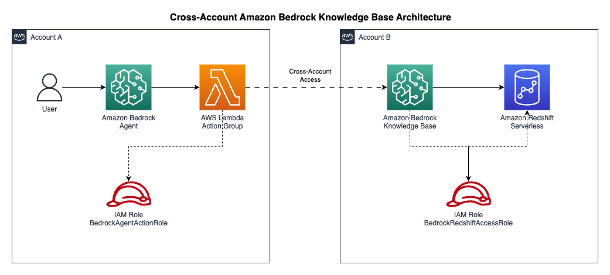

The solution follows these key aspects:-

1. Amazon Bedrock agent in the *agent* account that handles user interactions.
2. Amazon Redshift serverless workgroup in VPC and private subnet in the *agent-kb* account containing structured data.
3. Amazon Bedrock Knowledgebase which is using the Amazon Redshift serverless workgroup as structured data source.
4. AWS Lambda function in *agent* account.
5. Action group configuration that connects the agent in the *agent* account to the Lambda function.
6. IAM roles and policies that enable secure cross-account access.

## Prerequisites
This solution requires you to have the following.
1.	Two AWS accounts. Follow this [link](https://aws.amazon.com/resources/create-account/) to create an AWS account if you do not have one. Specific permissions required for both account which will be set up in subsequent steps.
2.	[Install the AWS CLI](https://docs.aws.amazon.com/cli/v1/userguide/cli-chap-install.html) (2.24.22 - current version)
3.	[Set up authentication using IAM user credentials for the AWS CLI](https://docs.aws.amazon.com/cli/latest/userguide/cli-authentication-user.html) for each account.
4.	Make sure you have [jq](https://jqlang.org/) installed, jq is lightweight command-line JSON processor. For example, in Mac you can use the command brew install jq (jq-1.7.1-apple – current version) to install it.

## Assumption
Let’s call the AWS account *agent* profile that has the Amazon Bedrock agent. Similarly, the AWS account profile be called *agent-kb* that has the Amazon Bedrock knowledge base with Amazon Redshift Serverless and the structured data source. We will use *us-west-2 (Oregon)* region but feel free to choose a region as necessary. We will use the *meta.llama3-1-70b-instruct-v1:0* model for the *agent-kb*. This is an available on-demand model in *us-west-2 (Oregon)*. You are free to choose other models with cross-region inference but that would mean changing the roles and polices accordingly and enable model access in all US regions they are available in. For the *agent* we will be using Amazon Bedrock agent optimized model like *us.amazon.nova-pro-v1:0*. 

## Implementation walkthrough
Following are the step by implementation guide. Make sure that all set ups are in the same region in both accounts.

### Step 1: Make a note of AWS account numbers in agent and agent-kb account.
In the implementation steps we will refer them as follows. 

| Profile | AWS Account | Description |
|---|---|---|
| agent | 000000000000 | Account for the Bedrock Agent |
| agent-kb | 999999999999 | Account for the Bedrock Knowledge base |

> [! NOTE] 
>The above all assumed profile names and account numbers, please replace with actuals before running.

### Step 2: Create the Amazon Redshift Serverless workgroup in *agent-kb* account
1.	Log on to the *agent-kb* account
2.	Follow the [workshop link](https://catalog.us-east-1.prod.workshops.aws/workshops/a0b74876-043f-4cdb-9024-ce2b8471542d/en-US/getting-started/using-your-aws-account/019-cloudformation) to create the Amazon Redshift Serverless workgroup in private subnet.
3.	Make a note of the namespace, workgroup etc and follow the rest of the [hands-on workshop](https://catalog.us-east-1.prod.workshops.aws/workshops/a0b74876-043f-4cdb-9024-ce2b8471542d/en-US/dataloads-configurations) instructions.

### Step 3: Set up your data warehouse in *agent-kb* account
[Set up your data warehouse](https://catalog.us-east-1.prod.workshops.aws/workshops/a0b74876-043f-4cdb-9024-ce2b8471542d/en-US/dataloads-configurations/enabletpch) in *agent-kb* account.

### Step 4: Create your AI knowledge base in *agent-kb* account
[Create your AI knowledge base](https://catalog.us-east-1.prod.workshops.aws/workshops/a0b74876-043f-4cdb-9024-ce2b8471542d/en-US/dataloads-configurations/createkb) in agent-kb account. Make a note of the knowledge base ID.

### Step 5: Train your AI Assistant in *agent-kb* account
[Train your AI Assistant](https://catalog.us-east-1.prod.workshops.aws/workshops/a0b74876-043f-4cdb-9024-ce2b8471542d/en-US/dataloads-configurations/configurekb) in *agent-kb* account.

### Step 6: Test natural language queries in *agent-kb* account
[Test natural language queries](https://catalog.us-east-1.prod.workshops.aws/workshops/a0b74876-043f-4cdb-9024-ce2b8471542d/en-US/dataloads-configurations/testkb) in *agent-kb* account.

### Step 7: Create necessary roles and policies in both the accounts
  1. Run the script `create_bedrock_agent_kb_roles_policies.sh` with the below input parameters to create the necessary IAM resources.

| Input parameter | Value | Description |
|---|---|---|
| --agent-kb-profile | agent-kb | The agent knowledgebase profile that you set up with the AWS CLI with *aws_access_key_id*, *aws_secret_access_key* as mentioned in the prerequisite. |
| --lambda-role | lambda_bedrock_kb_query_role | This is the IAM role the agent account Bedrock agent action group lambda will assume to connect to the Redshift cross account |
| --kb-access-role | bedrock_kb_access_role | This is the IAM role the agent-kb account which the *lambda_bedrock_kb_query_role* in agent account assumes to connect to the Redshift cross account |
| --kb-access-policy | bedrock_kb_access_policy | IAM policy attached to the IAM role *bedrock_kb_access_role* |
| --lambda-policy | lambda_bedrock_kb_query_policy | IAM policy attached to the IAM role *lambda_bedrock_kb_query_role* |
| --knowledge-base-id | XXXXXXXXXX | Replace with the actual knowledge base ID created in Step 4 |
| --agent-account | 000000000000 | Replace with the 12-digit AWS account number where the Bedrock agent is running. (agent profile) |
| --agent-kb-account | 999999999999 | Replace with the 12-digit AWS account number where the Bedrock knowledge base is running. (agent-kb profile) |

  2. If you are still not clear on the script usage or inputs, then you can run the script with the --help option then the script will display the usage.

```bash
scripts/create_bedrock_agent_kb_roles_policies.sh --help
```
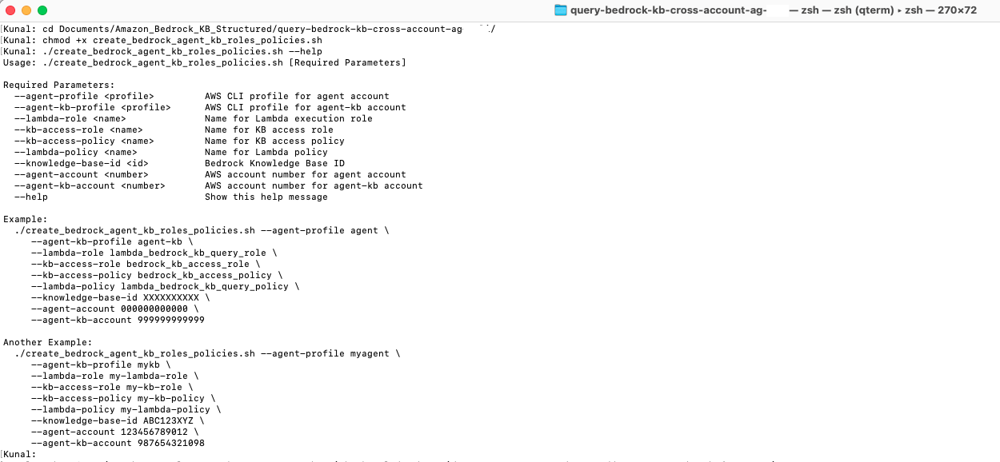

  3. Run the script with the right input parameters as described in the table above.

```bash
scripts/create_bedrock_agent_kb_roles_policies.sh \
     --agent-profile agent \
     --agent-kb-profile agent-kb \
     --lambda-role lambda_bedrock_kb_query_role \
     --kb-access-role bedrock_kb_access_role \
     --kb-access-policy bedrock_kb_access_policy \
     --lambda-policy lambda_bedrock_kb_query_policy \
     --knowledge-base-id XXXXXXXXXX \
     --agent-account 000000000000 \
     --agent-kb-account 999999999999
```

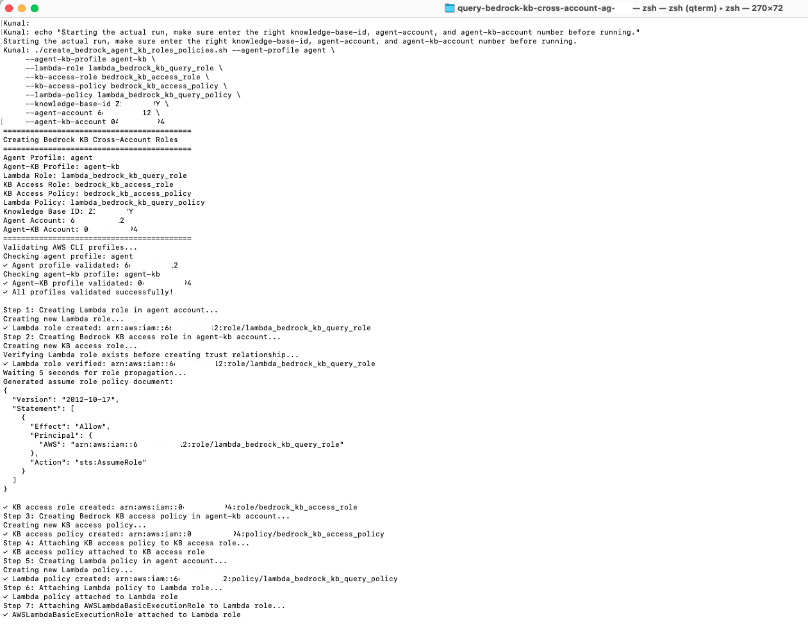

  4. The script on successful execution shows the summary of the IAM, roles and policies created in both accounts.

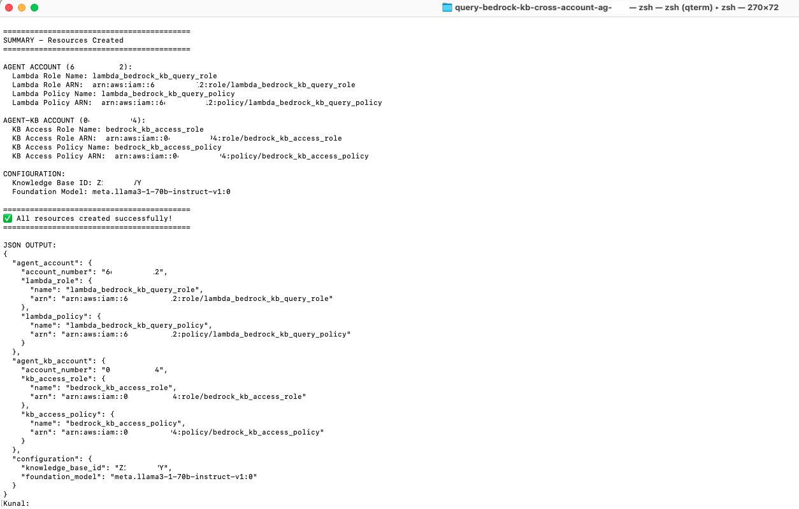

  5. Log on to both *agent* and *agent-kb* account to verify the IAM roles and policies are created.

    ***agent* account**:-
    Make a note of the ARN of the *lambda_bedrock_kb_query_role* as that will be the value of CloudFormation stack parameter *AgentLambdaExecutionRoleArn* in the next step.

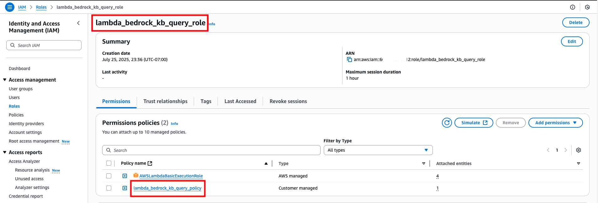

  ***agent-kb* account**:-
  Make a note of the ARN of the *bedrock_kb_access_role* as that will be the value of CloudFormation stack parameter *TargetRoleArn* in the next step.

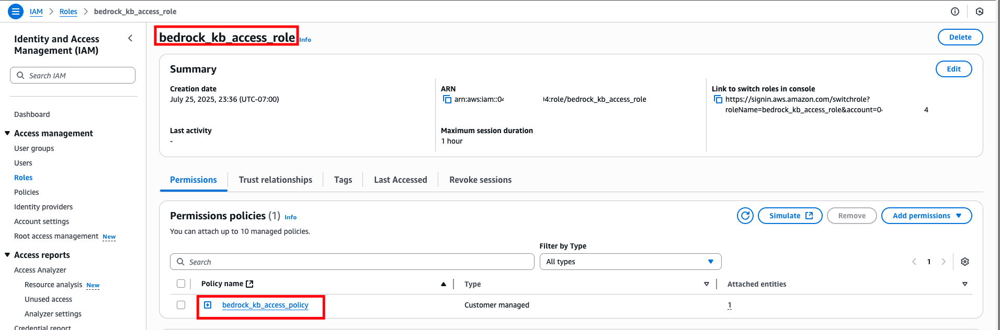

### Step 8: Run CloudFormation script to create Bedrock Agent
  1. Log on to the *agent* account and navigate to CloudFormation console, and make sure you are in us-west-2 (Oregon), click on *Create stack* and choose *With new resources (standard)*.

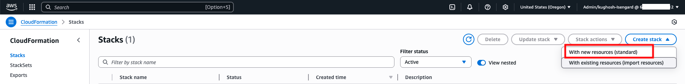

  2. In the *Specify template* section choose *Upload a template file* and then click on *Choose file* and select the file `scripts/cloudformation_bedrock_agent_kb_query_cross_account.yaml`. Then click *Next*.

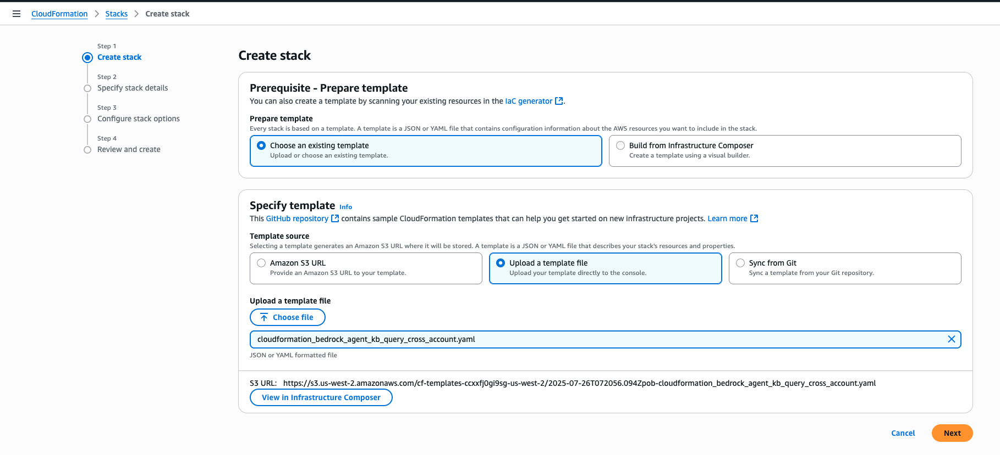

  3. Enter the following stacj details and click *Next*.

| Parameter | Value | Description |
|---|---|---|
| Stack name | bedrock-agent-connect-kb-cross-account-agent | You can choose any name | 
| AgentFoundationModelId | us.amazon.nova-pro-v1:0 | **Do not change** |
| AgentLambdaExecutionRoleArn | arn:aws:iam::000000000000:role/lambda_bedrock_kb_query_role | Replace with you **agent** account number |
| BedrockAgentDescription | Agent to query inventory data from Redshift Serverless database | Keep this as default |
| BedrockAgentInstructions | You are an assistant that helps users query inventory data from our Redshift Serverless database using the action group | **Do not change** |
| BedrockAgentName | bedrock_kb_query_cross_account | Keep this as default |
| KBFoundationModelId | meta.llama3-1-70b-instruct-v1:0 | **Do not change** |
| KnowledgeBaseId | XXXXXXXXXX | Knowledge base id from **Step 4** |
| TargetRoleArn | arn:aws:iam::999999999999:role/bedrock_kb_access_role | Replace with you **agent-kb** account number |

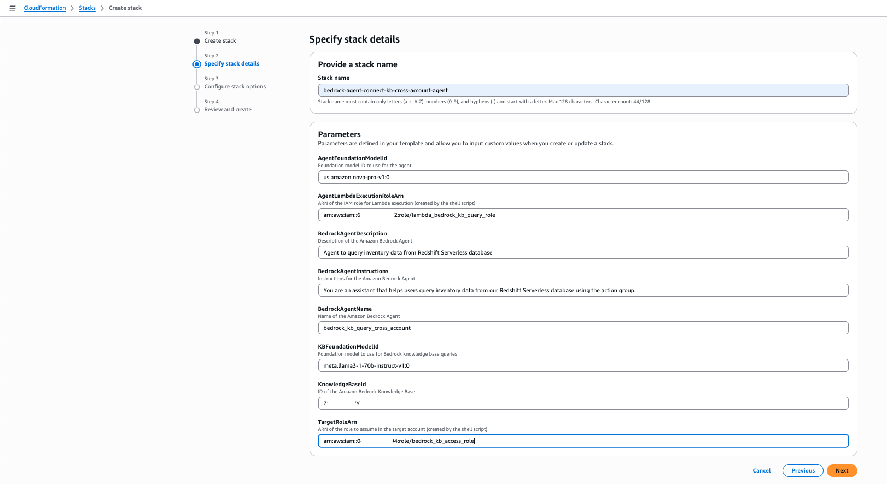

  4. Click on the acknowledgement and click *Next*.

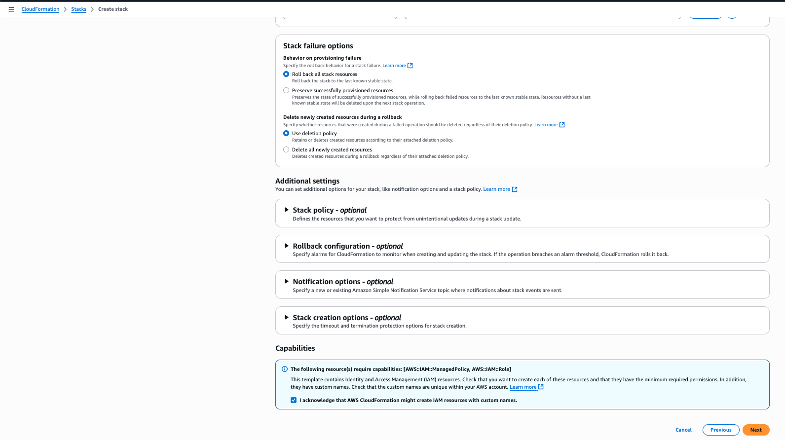

  5. Scroll down and click *Submit*.

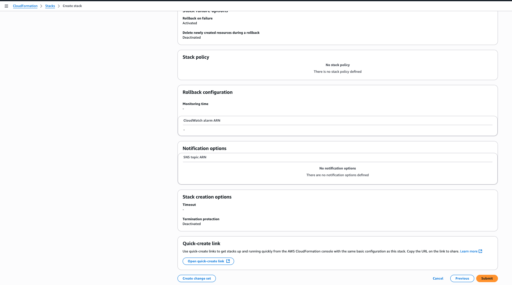

  6. You will see the CloudFormation stack is getting created as shown by the status *CREATE_IN_PROGRESS*.

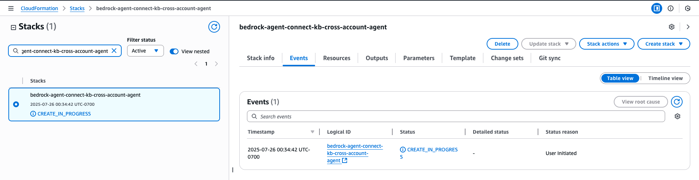

  7. It will take a few mins, and you will see the status change to *CREATE_COMPLETE* indicating creation of all resources. Click on the Outputs tab to make a note of the resources which got created.

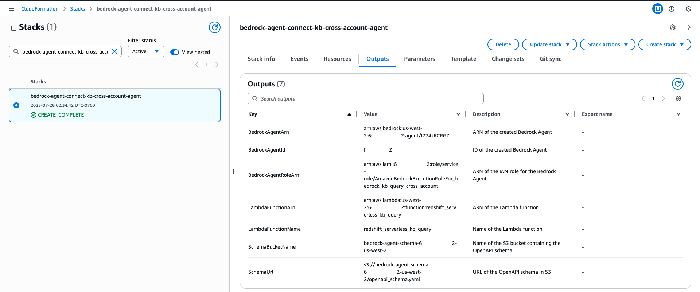

The CloudFormation script does the following in the agent account.
  * Creates a Bedrock agent
  * Creates an action group
  * Also creates a lambda function which is invoked by the bedrock action group
  * Defines the openapi schema
  * Creates necessary roles and permissions for the bedrock agent
  * Finally, it prepares the bedrock agent so that it is ready to test.

### Step 9: Check for model access in Oregon (us-west-2)
  1. Need Nova Pro (*us.amazon.nova-pro-v1:0*) model access in **agent** account. Navigate to Bedrock console and click on *Model access* under *Configure and learn*. Search on the *Model name : Nova Pro* to ensure access. If not, then enable access.

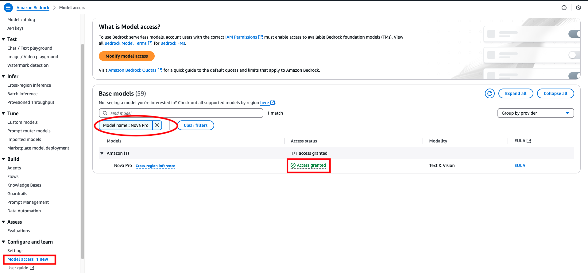

  2. Need *meta.llama3-1-70b-instruct-v1:0* access in **agent-kb** account. This should be already enabled as we set up the knowledge base earlier.

### Step 10: Run the agent
To run the bedrock agent.
  1. Log on to **agent** account
  2. Navigate to Amazon Bedrock console and click on *Agents* under *Build*.

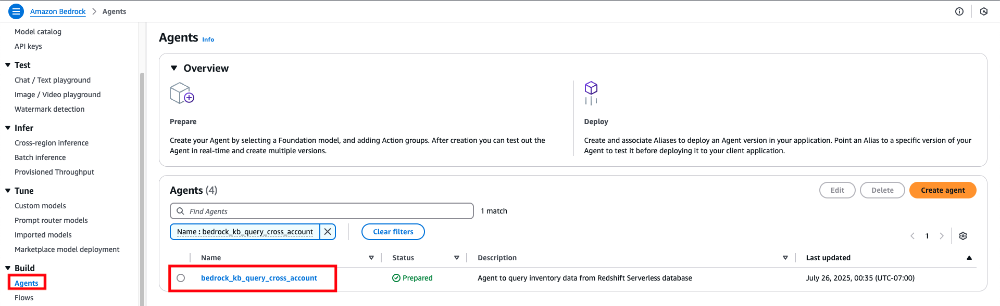

  3. Click on the agent’s name and the click on *Test*. You can test the following questions as mentioned the workshop’s [Stage 4: Test Natural Language Queries](https://studio.us-east-1.prod.workshops.aws/preview/a0b74876-043f-4cdb-9024-ce2b8471542d/builds/5e0d4dd9-5522-4171-94ba-5760a0ce2ee8/en-US/dataloads-configurations/testkb) page. Following are the questions you can ask.


      1. `who are the top 5 customers in saudi ARABIA`

      2. `who are the top parts supplier in united states by volume`

      3. `what is the total revenue by region for the year 1998`

      4. `which products have the highest profit margins`

      5. `show me orders with the highest priority from the last quarter of 1997`

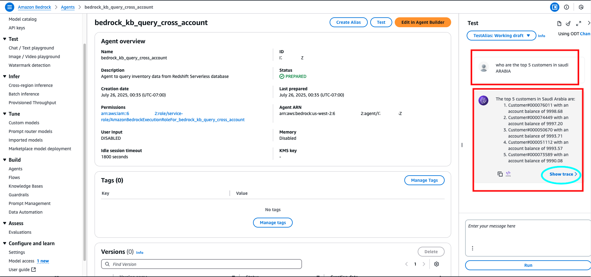

  4. Click on Show trace to investigate the agent traces.

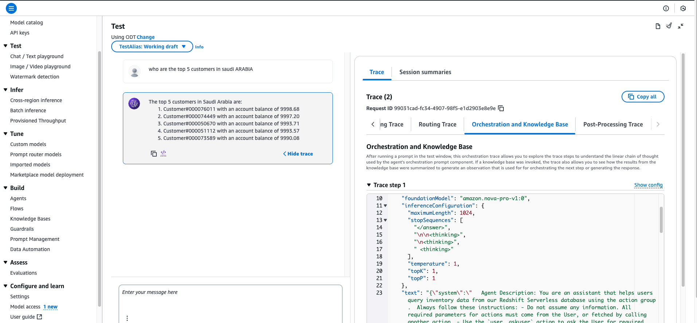

## Troubleshooting

### Common Issues

1. **Role Assumption Failures**
   - Verify trust relationships are correctly configured
   - Check that account numbers match exactly
   - Ensure roles exist in the correct accounts

2. **Knowledge Base Access Denied**
   - Confirm Knowledge Base ID is correct
   - Verify the KB access policy includes the right permissions
   - Check that the Knowledge Base exists in the Agent-KB account

3. **Lambda Timeout**
   - Increase Lambda timeout if queries are complex
   - Check CloudWatch logs for detailed error messages
   - Verify network connectivity between accounts

### Debugging Steps

1. **Check CloudWatch Logs**: Lambda function logs provide detailed error information
2. **Validate IAM Roles**: Use `aws sts assume-role` to test role assumption manually
3. **Test Knowledge Base**: Query the KB directly from the Agent-KB account
4. **Verify Permissions**: Use IAM policy simulator to test permissions

## Cleanup
To remove all resources created by this solution to avoind any unwarranted charges:

### Step 1: Delete CloudFormation Stack
Navigate to CloudFormation console for the agent and agent-kb account, search of the stack and click on Delete. As shown below. (Please note S3 buckets needs to be deleted separately.)

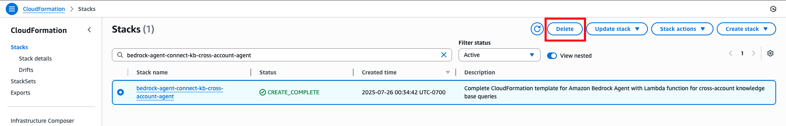

### Step 2: Delete IAM Resources
For deleting the roles and policies created in both accounts, download the script `scripts/delete-bedrock-agent-kb-roles-policies.sh`.

If you are still not clear on the script usage or inputs, then you can run the script with the `--help` option then the script will display the usage.

```bash
scripts/delete-bedrock-agent-kb-roles-policies.sh --help
```
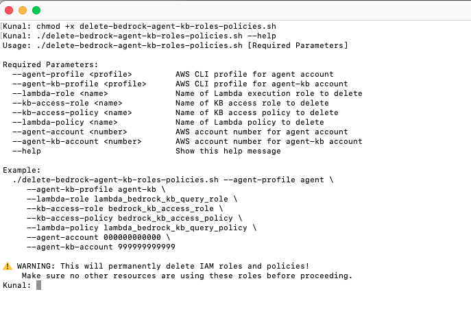

Run the script: `scripts/delete-bedrock-agent-kb-roles-policies.sh` with the same values for the same input parameters as in *Step7*. 

>Note: enter the right account numbers for *agent-account* and *agent-kb-account* before running

```bash
scripts/delete-bedrock-agent-kb-roles-policies.sh --agent-profile agent \
     --agent-kb-profile agent-kb \
     --lambda-role lambda_bedrock_kb_query_role \
     --kb-access-role bedrock_kb_access_role \
     --kb-access-policy bedrock_kb_access_policy \
     --lambda-policy lambda_bedrock_kb_query_policy \
     --agent-account 000000000000 \
     --agent-kb-account 999999999999
```
The script will ask for a confirmation, say **yes** and press enter.

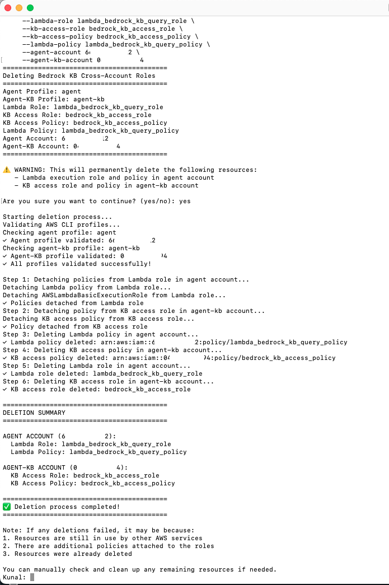

## Conclusion
This solution leverages Amazon Bedrock Knowledge Bases for Structured Data to create a more integrated approach to cross-account data access. The knowledge base in **agent-kb** account connects directly to Amazon Redshift Serverless in a private VPC. The Amazon bedrock agent in **agent** invokes an AWS Lambda function as part of its Action Group to make a cross-account connection to retrieve response from the structured knowledge base.

This architecture offers several advantages:
* Leverages Bedrock's native Knowledge Base capabilities for structured data
* Provides a more seamless integration between the agent and the data source
* Maintains proper security boundaries between accounts
* Reduces the complexity of direct database access code

## Cost Considerations
- **Bedrock Agent**: Pay per request and token usage
- **Lambda**: Pay per invocation and execution time
- **S3**: Minimal storage costs for schema file
- **Cross-Account Data Transfer**: May incur charges depending on region

## Code of Conduct
See [CODE_OF_CONDUCT](CODE_OF_CONDUCT.md) for more information.

## Contributing Guidelines
See [CONTRIBUTING](CONTRIBUTING.md#security-issue-notifications) for more information.

## License
This library is licensed under the MIT-0 License. See the [LICENSE](LICENSE) file.